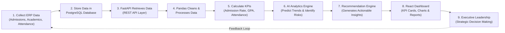

# Agentic AI Institutional Decision Engine - ICFAI Tech School

[](https://reactjs.org/)
[](https://www.typescriptlang.org/)
[](https://tailwindcss.com/)
[](https://vitejs.dev/)
[](https://fastapi.tiangolo.com/)
[](https://www.postgresql.org/)

An AI-powered decision support system designed specifically for **ICFAI Tech School**. This platform transforms institutional ERP data (Admissions, Academics, Attendance) into actionable insights, automated risk recommendations, and interactive performance dashboards for executive leadership, faculty, and administration.

---

## 📌 Project Overview

The **Agentic AI Institutional Decision Engine** empowers institutional leaders with data-driven decision-making capabilities. It bridges raw campus data with machine learning analytics and LLM recommendation pipelines to monitor student intake, identify academic failure risks early, audit mandatory attendance thresholds, and deliver real-time institutional intelligence.

### Key Capabilities
- 🔐 **Role-Based Authentication**: Custom sign-in matching official ICFAI Tech School branding with **Admin**, **Faculty**, and **Viewer** role tabs, Google Sign-In redirect, and live user session logging.
- 📊 **Executive Command Dashboard**: Responsive layout with deep navy sidebar (`#0A1F44`), academic year filters (`2024 - 2025`), global search, notification counters, and modular views.
- 👥 **Admissions Analytics**: Track total application volume, branch demand index, seat allocation rates (1st and 2nd choice), and branch utilization.
- 🎓 **Academic Risk Engine**: Identify students scoring under 40/100 marks before final exams, monitor scholarship eligibility (>8 CGPA), and track NPTEL course completions.
- 📅 **Attendance Audit & Compliance**: Real-time tracking of overall attendance percentages with automated alerts for students dropping below mandatory **75%** and critical **65%** thresholds.
- ⚙️ **User Activity & Audit Logs**: Live table recording all login sessions (email, role, timestamp, status, device) with PostgreSQL backend schema integration.
- 📄 **Custom Reporting & Export**: Generate PDF and Excel summaries for institutional review.

---

## 🛠️ Tech Stack

### Frontend Application
- **Framework**: [React.js 18](https://reactjs.org/) + [TypeScript](https://www.typescriptlang.org/)
- **Build Tool**: [Vite](https://vitejs.dev/)
- **Styling**: [Tailwind CSS](https://tailwindcss.com/) + [PostCSS](https://postcss.org/)
- **Icons**: [Lucide React](https://lucide.dev/)
- **Routing**: [React Router DOM v6](https://reactrouter.com/)

### Backend & Database Architecture
- **Backend Framework**: [FastAPI](https://fastapi.tiangolo.com/) (Python)
- **ORM & Validation**: SQLAlchemy + Pydantic
- **Authentication**: JWT (JSON Web Tokens) + Role-Based Access Control (RBAC)
- **ASGI Server**: Uvicorn
- **Database**: [PostgreSQL](https://www.postgresql.org/)

### AI & Analytics Pipeline
- **Data Analytics**: Python (Pandas, NumPy, Scikit-learn)
- **Generative AI**: OpenAI API / Ollama + Llama 3
- **Visualizations**: Recharts / Power BI Integration

### Infrastructure & Deployment
- Docker, Git, GitHub, Vercel, Render

---

## 🔄 End-to-End System Workflow



1. **ERP Data Collection**: Collect raw records across Admissions, Academics, Attendance, and Finance.
2. **PostgreSQL Persistence**: Ingest and structure historical and transactional data in PostgreSQL.
3. **FastAPI API Layer**: Expose secure JWT-authenticated endpoints for frontend data fetching.
4. **Pandas Data Cleaning**: Aggregate metrics, calculate moving averages, and clean data frames.
5. **KPI Calculation**: Compute admission intake rates, seat utilization, student GPAs, and attendance compliance.
6. **AI Analytics & Risk Identification**: Scikit-learn and Llama 3 models flag at-risk students and high-demand branches.
7. **Actionable Recommendations**: Generate contextual alert cards and intervention suggestions.
8. **React Dashboard**: Render real-time metrics, interactive charts, and user activity logs.
9. **Strategic Action**: Administrators execute data-driven interventions.

---

## 📊 Key Performance Indicators (KPIs)

| KPI | Module | Description |
| :--- | :--- | :--- |
| **Total Applications** | Admissions | Total student application volume for ICFAI Tech School indicating overall demand. |
| **First Choice Allocation Rate (%)** | Admissions | Percentage of students allocated to their 1st preferred engineering branch. |
| **Second Choice Allocation Rate (%)** | Admissions | Percentage of students allocated to their 2nd preferred branch. |
| **Seat Utilization Rate (%)** | Admissions | Percentage of total available seats filled across all engineering departments. |
| **Branch Demand Index** | Admissions | Departmental demand based on student first-choice preferences. |
| **Overall Attendance (%)** | Attendance | Average institutional attendance percentage across all enrolled students. |
| **Students Below 75% Attendance** | Attendance | Total number of students below the mandatory 75% attendance threshold. |
| **Students Below 65% Attendance** | Attendance | Total number of students below critical 65% attendance requiring immediate warning. |
| **Students at Risk of Failure (<40 Marks)** | Academics | Students scoring below 40/100 requiring academic remediation. |
| **Scholarship-Eligible Students (>8 CGPA)** | Academics | Percentage of high-performing students eligible for merit scholarships. |
| **NPTEL Course Participation (%)** | Academics | Percentage of students enrolled in or completing NPTEL certifications. |
| **AI Actionable Recommendations** | Agentic AI | Real-time automated recommendations generated from cross-module analytics. |

---

## 📂 Project Structure

```
agentic-ai-sp/
├── App.tsx             # Main React Router setup (LoginPage & DashboardPage routes)
├── AuthContext.tsx     # Global authentication context & localStorage login audit logger
├── DashboardPage.tsx   # Command hub layout, deep navy sidebar, header & module views
├── LoginPage.tsx       # ICFAI Tech School branded authentication page & Google sign-in
├── main.tsx            # React application entry point
├── index.css           # Tailwind base directives & custom font styling
├── index.html          # HTML entry point with Inter & Serif Google Fonts
├── tailwind.config.js  # Custom Tailwind design system tokens (brand-red, brand-blue, navy)
├── postcss.config.js   # PostCSS configuration for Tailwind CSS
├── vite.config.ts      # Vite dev server configuration (Port 3000)
├── tsconfig.json       # TypeScript compiler options
├── package.json        # Project metadata, dependencies, and npm scripts
└── README.md           # Project documentation
```

---

## 🚀 Local Development Setup

### Prerequisites
- [Node.js](https://nodejs.org/) (v18.0.0 or higher)
- `npm` (v9.0.0 or higher)

### Installation Steps

1. **Clone or Navigate to the Project Directory**:
   ```bash
   cd agentic-ai-sp
   ```

2. **Install Dependencies**:
   ```bash
   npm install
   ```

3. **Start the Development Server**:
   ```bash
   npm run dev
   ```

4. **Access the Application**:
   Open your browser and navigate to:
   **[http://localhost:3000/](http://localhost:3000/)**

---

## 🛡️ Authentication & User Activity Tracking

- **Demo Logins**: Select any role tab (**Admin**, **Faculty**, **Viewer**) on the login page and click **Sign In** to log in immediately.
- **Google Sign-In**: Click **Sign in with Google** to redirect to the official Google Accounts login portal.
- **User Activity Audit Logs**: Navigate to **Settings** in the dashboard to view real-time recorded login logs (email, role, timestamp, status, device).

---

## 📄 License

© 2025 ICFAI Tech School. All rights reserved. Proprietary institutional software.
